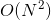

# 최소 신장 트리(Minimum Spanning Tree, MST)

> ### Spanning Tree
>
> > 그래프에서 모든 정점을 연결하되, 사이클이 존재하지 않도록 모든 정점을 간선으로 연결하는 트리.
>
> 간선의 가중치 합이 최소가 되도록 연결하며, _**하나의 그래프에서 무조건 MST가 하나만 생성된다고 보장하지는 못함.**_

## 1. Kruskal's Algorithm ✨

#### 간선 선택 기반

Greedy Method를 이용하여 모든 정점을 최소 비용으로 연결하는 방법.

- 탐욕적인 방법은 결정을 해야 하는 순간마다 최적인 것을 고르기 때문에, 선택하는 순간에는 최적이지만 전체적으로 최적이라는 보장이 없어 검증이 필요.
  - Kruskal 알고리즘은 최적의 해답을 주는 것으로 증명됨.

#### 풀이 과정

1. 간선들을 가중치의 오름차순으로 정렬.
2. 정렬된 순서대로 사이클을 형성하지 않는 간선을 선택.
   - 간선을 선택할 때, 사이클을 형성하는지 확인하기 위해 유니온 파인드 사용.

#### 시간 복잡도

.gif)

## 2. Prim's Algorithm

#### 정점 선택 기반

시작 정점에서 출발하여 스패닝 트리 집합을 단계적으로 확장해나가는 방법.

#### 풀이 과정

1. 시작 정점만 MST 집합에 포함.
2. 이전 단계에서 만들어진 MST와 인접한 정점 중 연결된 간선의 가중치가 최소인 정점을 선택.
   - Kruskal과 마찬가지로 사이클을 형성하지 않아야 함.
   - 정점을 선택할 때, 우선순위 큐를 이용하여 인접한 정점들을 탐색.
3. 위의 과정은 트리가 `N-1`개의 간선을 가질 때까지 반복.

#### 시간 복잡도

- Prim's Algorithm의 시간복잡도는 그래프와 가중치에 의한 정점 정렬에 사용된 자료구조에 영향을 받음.

|                자료구조                |                  시간복잡도                  |
| :------------------------------------: | :------------------------------------------: |
|               인접 행렬                |         |
|         이진 힙 / 인접 리스트          | .gif) |
| 피보나치 힙 / 인접 리스트(최악의 경우) | .gif) |

